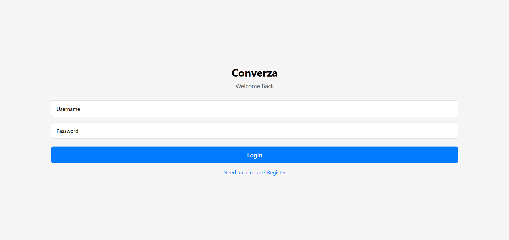
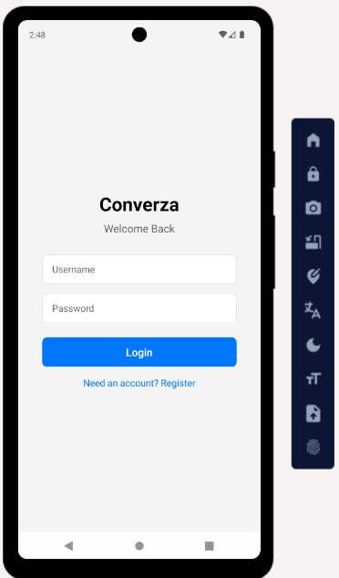

<h1 align="center">
  <br/>
  Converza
</h1>
<p align="center">
  ⚡️ Cross-platform chat & peer-to-peer video calling — built with React Native&nbsp;(Expo) and FastAPI
</p>

<p align="center">
  <a href="https://converza-ewii.onrender.com/health">
    
  </a>
  <a href="https://appetize.io/app/b_yztynh3vyry364hxjsva3va6la">
    
  </a>
  
  
</p>

---

## ✨ Features
|           | Mobile & Web |
|-----------|--------------|
| 🔒 JWT authentication | ✓ |
| 💬 Real-time 1-to-1 chat (WebSocket) | ✓ (<150 ms latency) |
| 📷 Peer-to-peer **video call** (`useWebRTC.ts` hook) | ✓ |
| 📌 Auto-scroll, long-message wrapping | ✓ |
| ☁️ Live deployment (Render + Appetize) | ✓ |

---

## 📸 Demo

| Web (Chrome) | Android (Appetize iframe) |
|--------------|---------------------------|
|  |  |

> First load may take ~30 s while the free Render instance cold-starts.

• **Live API** `https://converza-ewii.onrender.com/health`  
• **Interactive demo** `https://appetize.io/app/b_yztynh3vyry364hxjsva3va6la`

---

## 🏗️  Tech Stack
| Layer | Main libs |
|-------|-----------|
| Front-end | Expo SDK 53, React Navigation 6, React-Native-Web, `react-native-webrtc` |
| Back-end | FastAPI 0.115, SQLAlchemy 2, Uvicorn 0.34 |
| Auth | OAuth2 Password Flow, JWT (`python-jose`) |
| Infra | Render (Free tier, Oregon), Appetize.io (Free), EAS Build |

---

## 📂  Repo Structure
```bash
converza/
├── app.json # Expo config (camera/mic permissions, API_BASE)
├── eas.json # Dev, preview, production build profiles
├── backend/
│ ├── app/
│ │ ├── main.py # FastAPI app + CORS
│ │ ├── auth/ # JWT utils & deps
│ │ ├── models/ # User, Message
│ │ └── api/endpoints/
│ │ ├── auth.py # /register, /login, /me
│ │ └── chat.py # REST history + WebSocket signalling
│ └── requirements.txt
├── src/
│ ├── navigation/AppNavigator.tsx
│ ├── screens/
│ │ ├── LoginScreen.tsx
│ │ ├── ChatListScreen.tsx
│ │ ├── ChatScreen.tsx
│ │ └── VideoCallScreen.tsx # local + remote streams
│ ├── hooks/
│ │ ├── useChatSocket.ts # JWT-secured WebSocket
│ │ └── useWebRTC.ts # offer / answer / ICE
│ └── services/api.ts
```

---

## 🚀  Local Setup

```bash
# 1. clone
git clone https://github.com/dhruvxsingh/Converza.git
cd Converza

# 2. backend (Python 3.11)
cd backend
python -m venv venv && source venv/bin/activate
pip install -r requirements.txt
uvicorn app.main:app --reload --host 0.0.0.0 --port 8000

# 3. front-end (Node 18+)
cd ..
npm i -g expo-cli eas-cli
npm i
# dev-client (mobile) + web
npx expo start --dev-client --lan
npx expo start --web

```
## 🛠 Production Build
```bash

# production APK (renders API_BASE from eas.json)
eas build --profile production --platform android